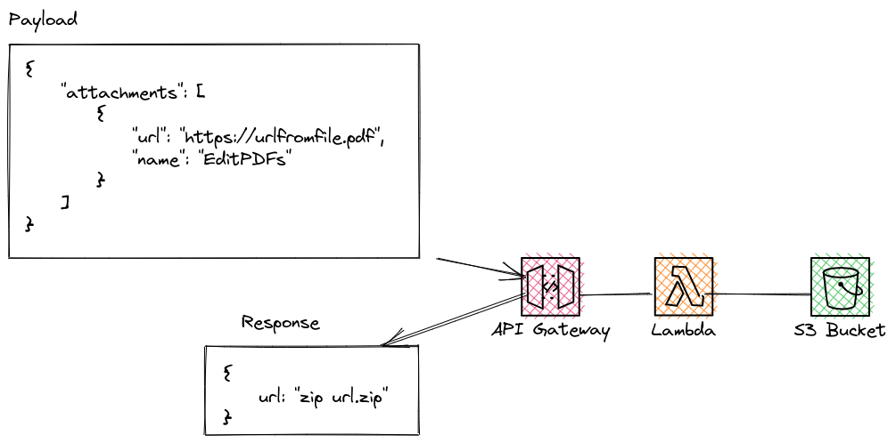

<!-- load the image from ./image.png  -->



The main idea is to send a list of url with files to download, compress and upload them to s3 bucket, and then return the url of the zip file.

Flow             
    1. Send a POST request to /download with a list of urls.                     
    2. The lambda function will trigger another lambda function.                    
    3. The other lambda function will download the files and compress them into a zip file.                              
    4. After the zip file is created, the lambda function will upload the zip file to s3 bucket.                                            
    5. The lambda function will send a email to the list of emails in the request body.                            


Example:

POST 
```json
{
    "attachments": [
        {
            "url": "https://test.pro/test/test/2701637",
            "name": "128_082022.pdf"
        }
    ],
    "emails": ["test@test.io"]
}
```

Response

```json
{
    "message": "Success"
}
```