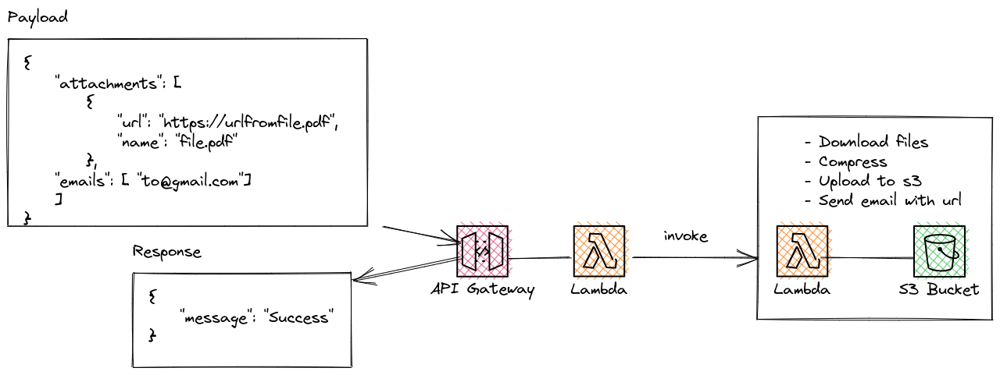

<!-- load the image from ./image.png  -->



The main idea is to send a list of url with files to download, compress and upload them to s3 bucket, and then return the url of the zip file.

Example:

POST 
```json
{
    "attachments": [
        {
            "url": "https://i.gadgets360cdn.com/large/jpg_to_pdf_1591980583835.jpg",
            "name": "imagen1"
        }
    ]
}
```

Response

```json
{
   "url": "https://zipfiles123456.s3.amazonaws.com/zip-1661743310527.zip"
}
```